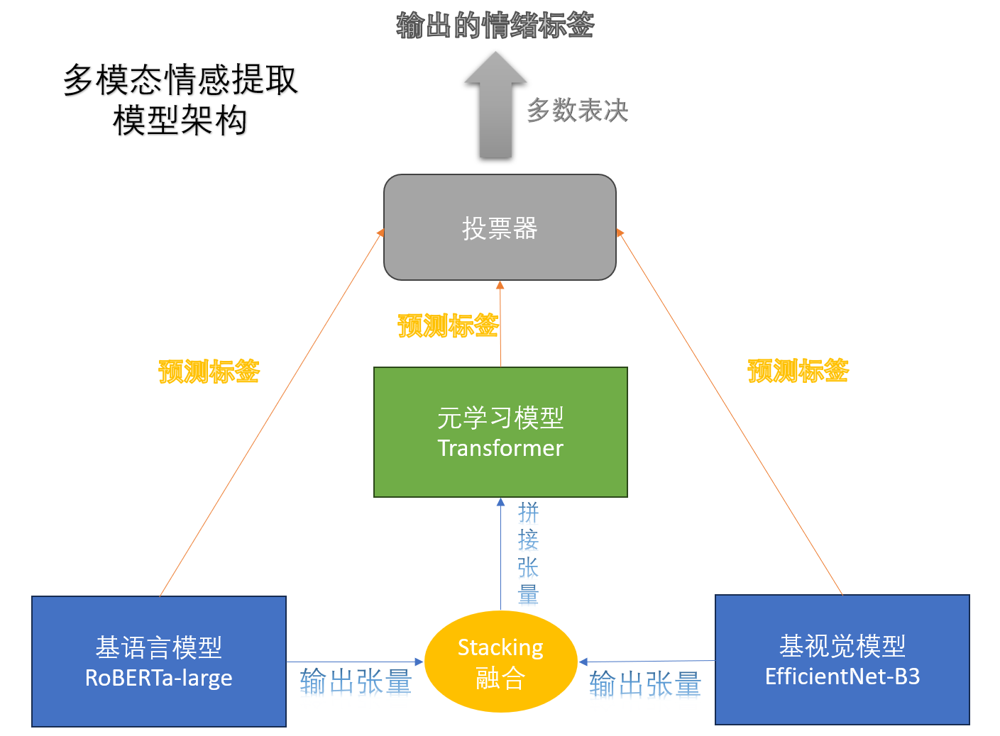

# 多模态情绪分析模型

基于RoBERTa和EfficientNet搭建的多模态情绪分析模型，可以从文本和图片两个方面进行情绪计算

## 模型介绍：

模型采用两级架构并引入投票机制，以尽可能提升整体模型的鲁棒性，结合各个模态进行情绪计算




## 项目依赖

使用如下命令以安装项目依赖

```python
pip install -r requirements.txt
```

## 项目结构

```python
|-- code # 保存项目代码
    |-- EfficientNet.py 
    |-- preprocess_test.py
    |-- preprocess_train.py
    |-- Roberta_large.py
    |-- Transformer_predict.py
    |-- transformer.py
|-- data # 存放实际文本和图片数据的文件夹
    |-- 实验所需的所有文本和图片都放在这里
|-- model # 保存模型的位置
    |-- 代码生成的模型都保存在这
```

## 如何运行代码

1. 首先运行两个数据预处理脚本:preprocess_train.py和preprocess_test.py，产生可供模型直接使用的数据，保存至data文件夹：
```python
python preprocess_train.py
python preprocess_test.py
```

2. 训练两个基模型，并将训练好的模型保存至model文件夹：
```python
python Roberta_large.py
python EfficientNet.py 
```


3. 训练融合模型，并将训练好的模型保存至model文件夹：
```python
python transformer.py
```

4. 利用训练好的模型进行预测：
```python
python Transformer_predict.py
```